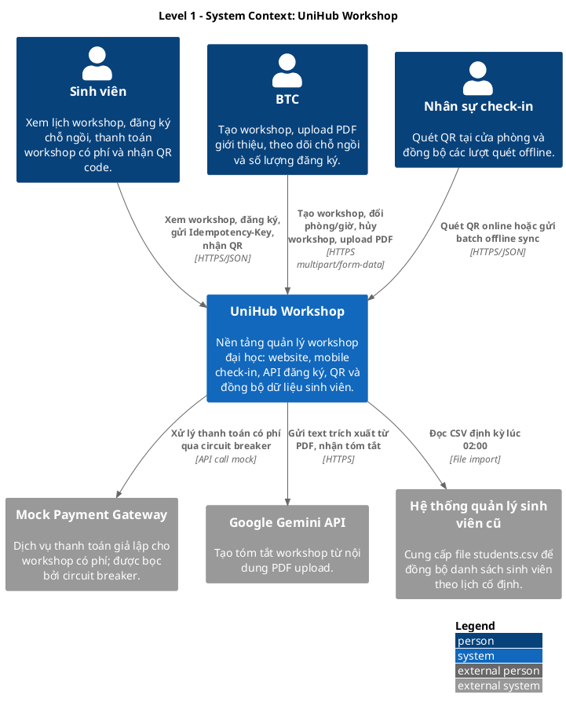
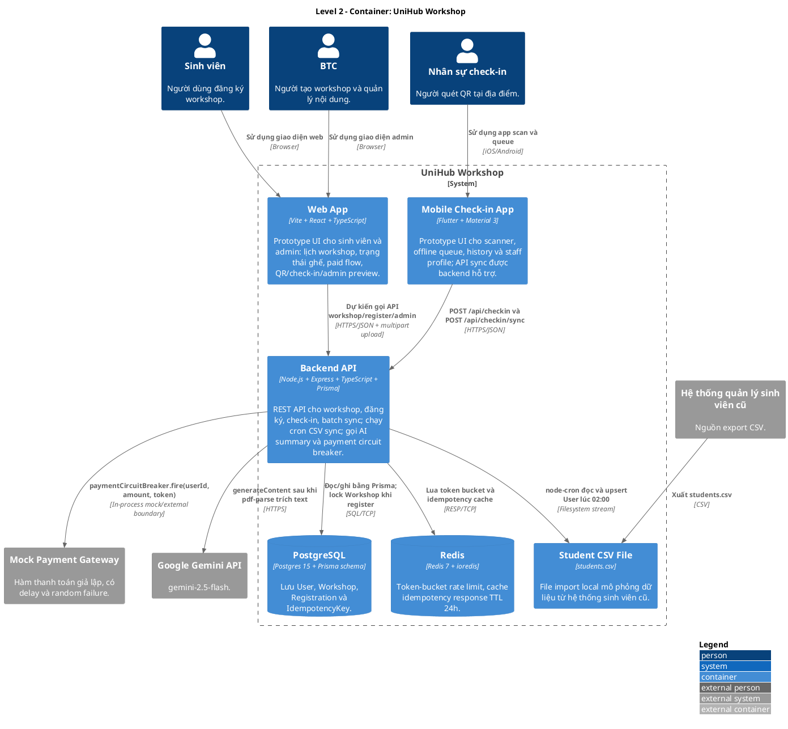
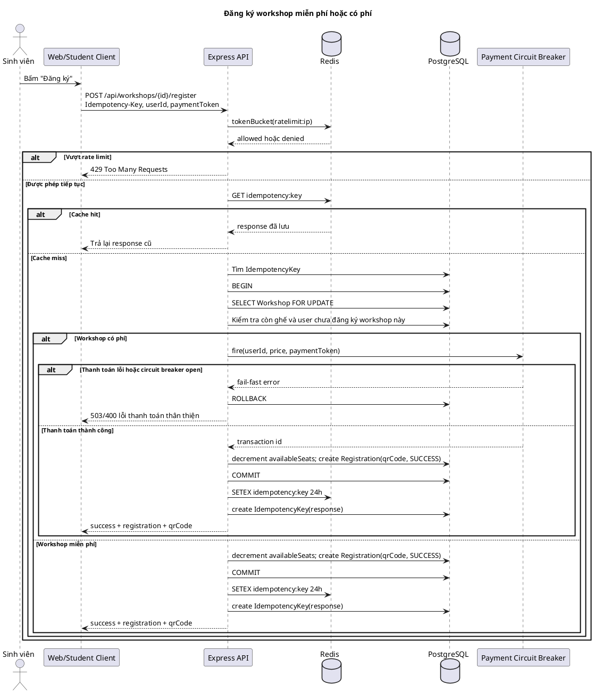
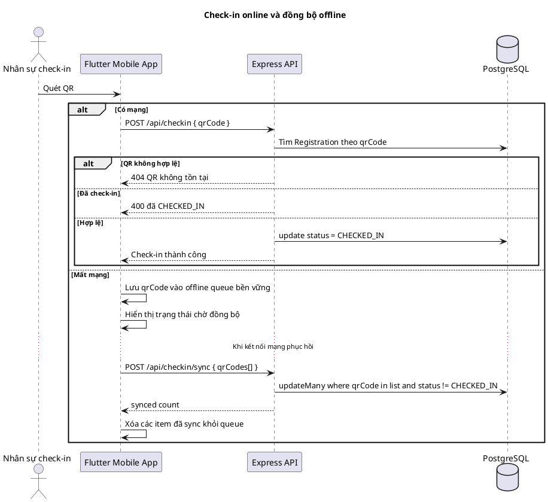
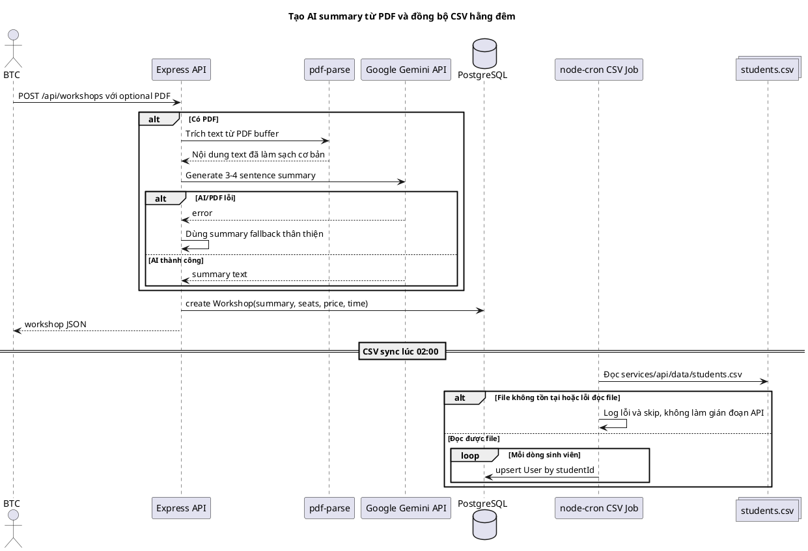

# UniHub Workshop - C4 Diagrams bằng PlantUML

Tài liệu này dùng PlantUML để mô tả hai cấp đầu của C4 diagram và các luồng runtime quan trọng của UniHub Workshop. Nội dung bám theo `REQUIREMENTS.md`: sự kiện kéo dài 5 ngày, mỗi ngày có 8-12 workshop song song, sinh viên đăng ký workshop miễn phí hoặc có phí, nhận QR để check-in, BTC quản trị workshop, và nhân sự check-in dùng mobile app có hỗ trợ offline sync.

## Level 1 - System Context

Level 1 đặt UniHub Workshop trong bức tranh tổng thể của trường đại học. Sinh viên, BTC và nhân sự check-in cùng sử dụng một hệ thống chung để xem workshop, tạo workshop, đăng ký, thanh toán nếu cần, nhận QR và điểm danh tại cửa phòng. Hệ thống tích hợp với cổng thanh toán mock, Google Gemini API để tạo tóm tắt từ PDF, và nguồn CSV sinh viên từ hệ thống quản lý cũ.

## Level 2 - Container

Level 2 phân rã UniHub Workshop thành các container đúng với code hiện tại. Backend API là Express service trung tâm; implementation hiện tại không có message broker hay worker riêng. Cron CSV sync chạy trong cùng process với API khi server start. Redis được dùng cho token-bucket rate limiting và cache idempotency response; PostgreSQL lưu dữ liệu chính và được lock pessimistic bằng `SELECT ... FOR UPDATE` khi đăng ký.

## Key Runtime Flows

### Đăng ký workshop miễn phí hoặc có phí

Luồng này xử lý cả workshop miễn phí và workshop có phí. Điểm quan trọng là request đăng ký đi qua rate limiting, idempotency, transaction và row-level lock trước khi trừ ghế. Với workshop có phí, payment gateway được gọi qua circuit breaker để tránh lỗi dây chuyền khi cổng thanh toán không ổn định.

### Check-in online và đồng bộ offline

Mobile app phải cho phép nhân sự check-in tiếp tục quét QR khi mất mạng. Khi online, app gọi API check-in từng QR. Khi offline, app lưu QR vào local queue và gửi batch sync khi có mạng trở lại. Server xử lý sync theo hướng idempotent: QR đã `CHECKED_IN` sẽ không bị update lại.

### Tạo AI summary từ PDF và đồng bộ CSV hằng đêm

BTC có thể upload PDF khi tạo workshop. Backend trích xuất text bằng `pdf-parse`, gửi sang Google Gemini API và lưu summary vào workshop. Dữ liệu sinh viên được đồng bộ từ file CSV hằng đêm vì hệ thống cũ không có API.

